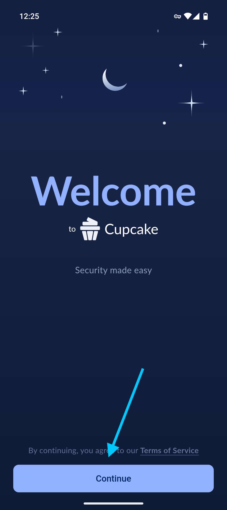
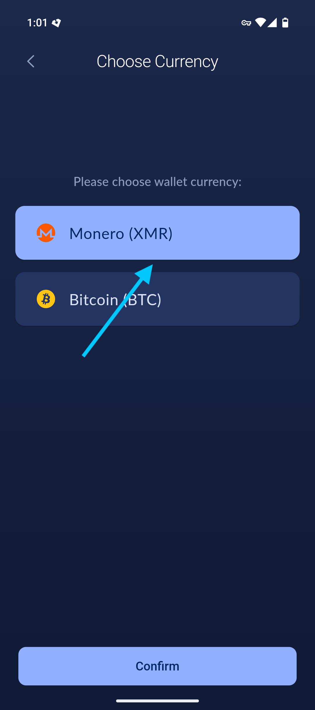
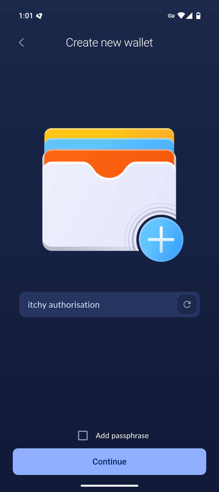
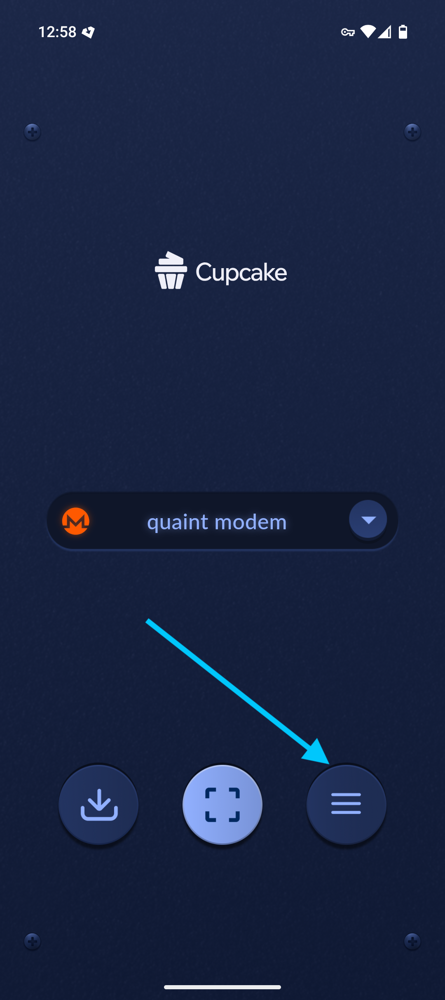
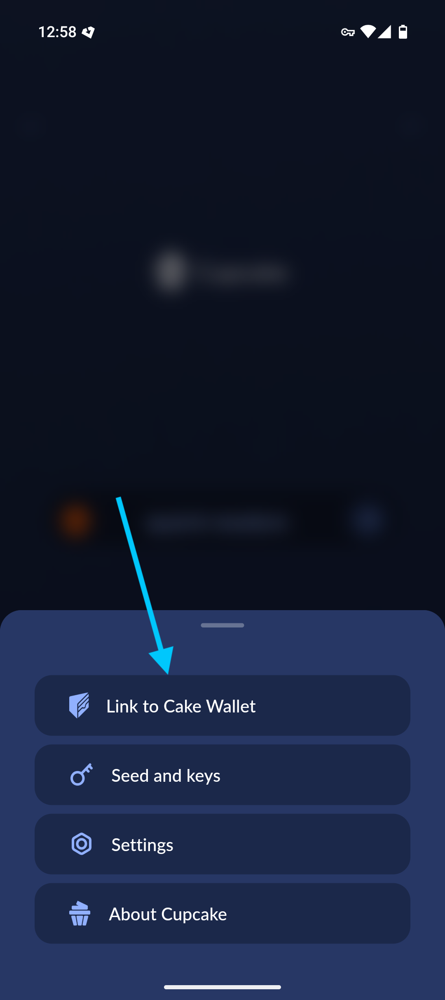
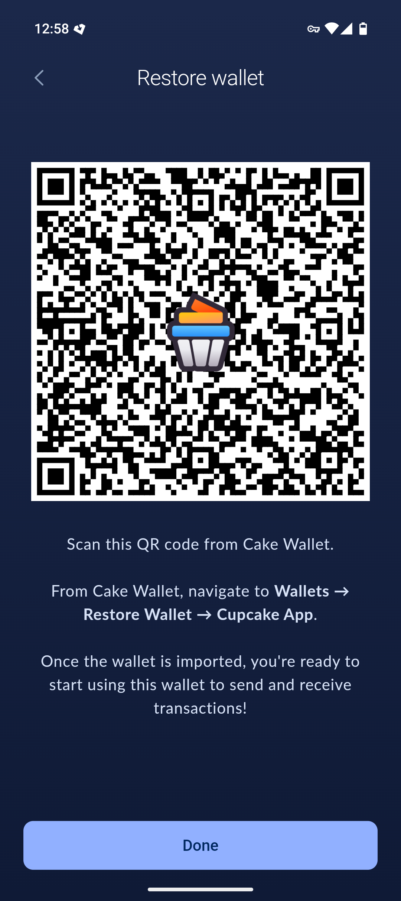
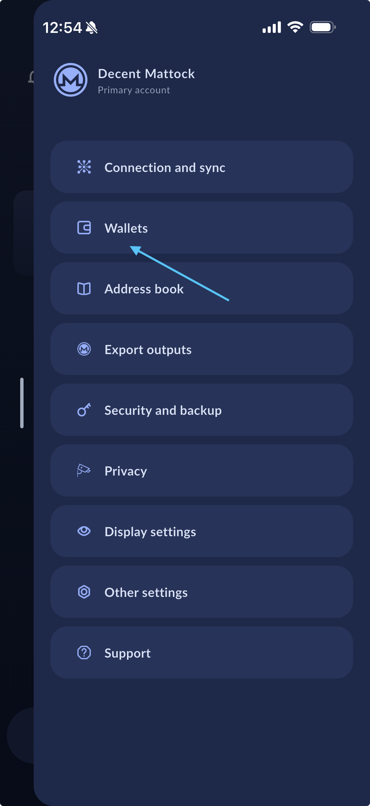
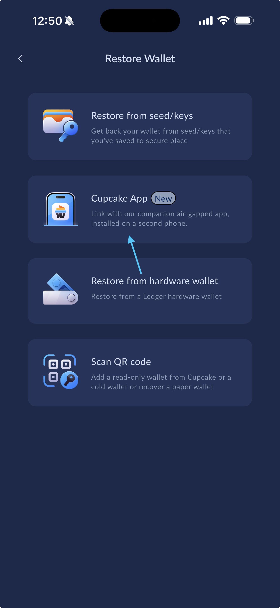
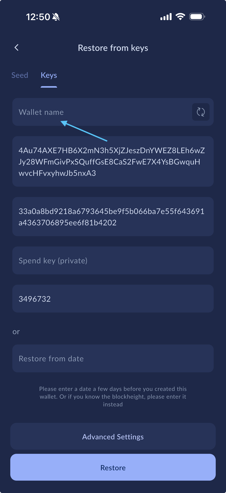

---
---

# Getting started with Cupcake

Wondering how to get started with Cupcake? We'll walk you through the onboarding step-by-step, making it as easy as possible for you to up your crypto security game.

## Creating a wallet

1. Walk through (or skip) the initial onboarding help
2. Choose your currency
3. Select `Create new wallet`
   1. Optionally, if you have an existing wallet you want to restore into Cake Wallet you can do that with `Restore wallet`
4. Set a strong, random PIN code or password
5. Choose a name for your wallet, or hit the button to get a random name
6. Securely save your seed phrase, and then verify you've saved it properly

{:width="32%"}
{:width="32%"}
{:width="32%"}

## Linking to Cake Wallet

As Cupcake has no access to the internet, to properly see your transaction history, balances, and to create and send new transactions you'll need to pair it with Cake Wallet.

1. To link with Cake Wallet, open the `Menu` and select `Link to Cake Wallet`. You'll use this QR in the next steps.

    {:width="32%"}
    {:width="32%"}
    {:width="32%"}

2. From Cake Wallet, enter the `Wallets` screen from either the Menu or the button on the bottom bar.
3. Select `Restore Wallet`, then select `Cupcake App`.
4. Scan the QR code shown in Cupcake.
5. Name your wallet as desired, and tap `Restore`

    {:width="32%"}
    {:width="32%"}
    {:width="32%"}
