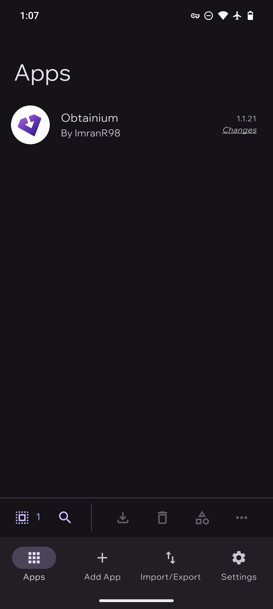
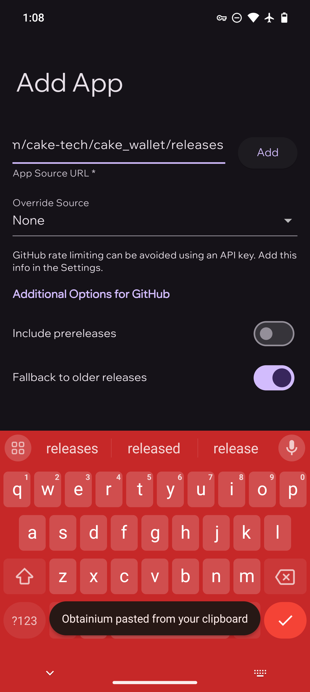
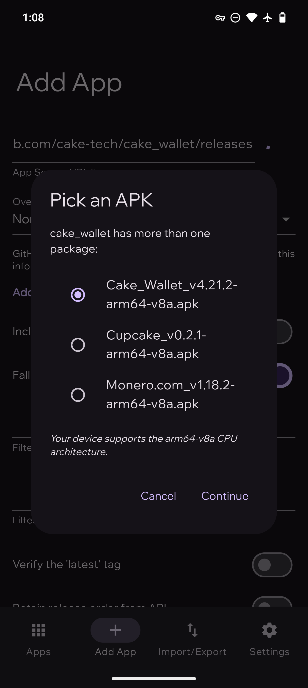
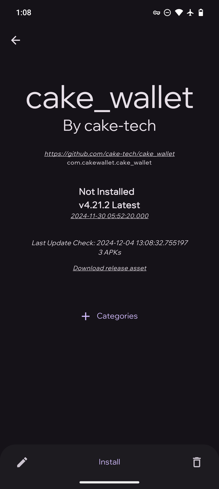
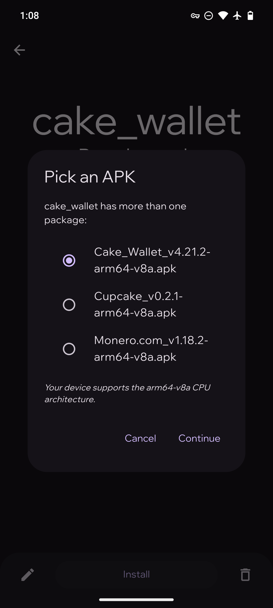
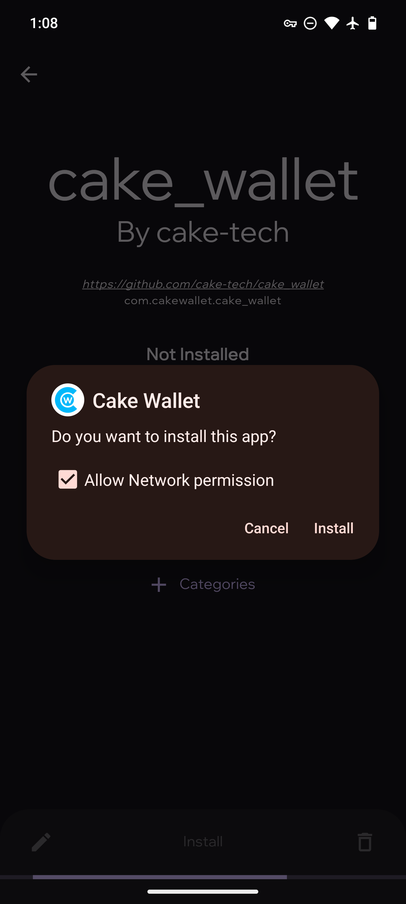

# :icons-Obtainium: Obtainium

!!! note ""
    Official Website: [obtainium.imranr.dev](https://obtainium.imranr.dev/){:target="_blank"}

Obtainium is an Android app that helps install and update apps directly from various sources.

Obtainium can be installed by downloading the latest release from F-Droid, the [official website](https://obtainium.imranr.dev/) or the [Obtainium GitHub repository](https://github.com/ImranR98/Obtainium)

Once Obtainium is installed, you are able to add Cake Wallet via our repository.

After opening Obtainium, press the `Add App` button on the bottom bar. Then, paste the Cake Wallet repository URL [https://github.com/cake-tech/cake_wallet/](https://github.com/cake-tech/cake_wallet/) into the `App Source URL` field, then press the `Add` button.

{:width="32%"}
{:width="32%"}

Select Cake Wallet or Monero.com wallet then press `Continue`.

{:width="32%"}
{:width="32%"}

Then press `Install` at the bottom of the app listing, and select the desired version once again if prompted.

{:width="32%"}
{:width="32%"}
