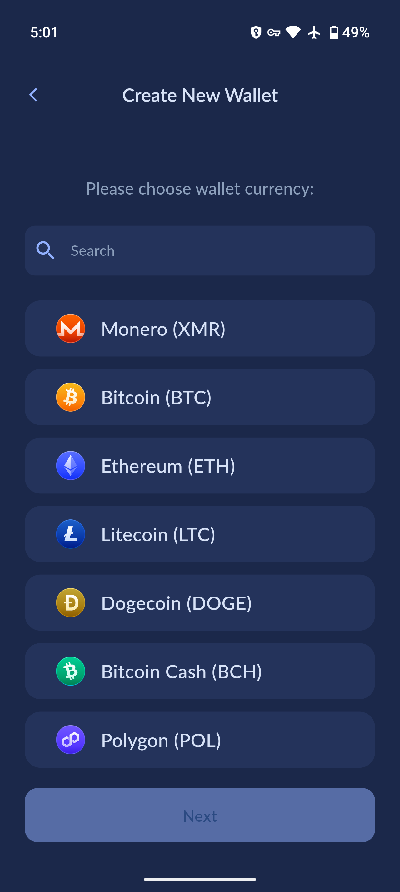
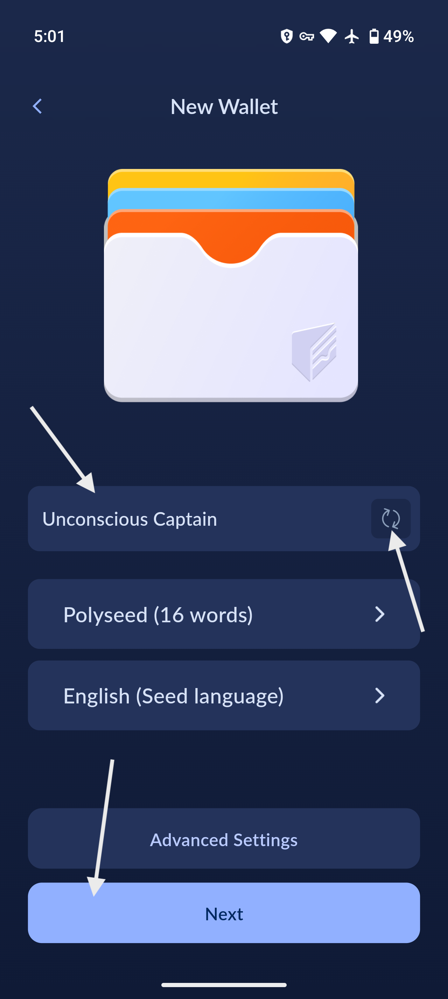

# Create new wallet

## Enter the wallets menu
<!-- ??? info "Tip for creating an additional wallet"

    Go to the menu at the top-right. Tap on `Wallets`, then tap `Create New Wallet` at the bottom of your screen.

    {:width="32%"}
    {:width="32%"}
    {:width="32%"} -->
Go to the menu at the top-right. Tap on `Wallets`, then tap `Create New Wallet` at the bottom of your screen.

{:width="32%"}
{:width="32%"}
{:width="32%"}

## Create the wallet
Start with a single cryptocurrency type, as you can choose more later.

{:width="32%"}
{:width="32%"}

You can create your own wallet name, or you can tap the right icon to generate a random name. This can be changed later.

{:width="32%"}

## Save your seed phrase!

!!! warning
    It is ***absolutely imperative*** that you ***save your seed in a safe place***! The most common user error is forgetting to save the seed, resulting in a loss of funds.

You need to save the seed in a safe place. The definition of "safe" depends on your use-case, but it looks like this for most users:

* Put one written copy in a home safe, and another copy in a bank safety deposit box.
* Store the seed in a secure password manager with a ***strong*** password.

If you need to upgrade to a higher security setup later, you can create a new wallet, back up the seed with a high degree of security, and then send your funds to the new wallet.

Proceed through the warning screen, and continue to save and verify your seed phrase. You can copy your seed phrase by tapping the copy button on the top right, or tap the `Save` button to open the system save prompt.

{:width="32%"}
{:width="32%"}

## Saving seed with password manager

Saving your seed to your password manager can be a great way to save your seed, but not all password managers are created equal, some are more secure than others and have had 3rd-party verification on the soundness of the client-side encryption implementation.

Here is a list of a few known-good password managers. Open-source ones are recommended:

| Name | Platforms | Type | License |
| --- | --- | --- | --- |
| Bitwarden | Desktop, Mobile, Web | Cloud ☁️ | GPLv3 ✅ |
| Proton Pass | Mobile, Web | Cloud ☁️ | GPLv3 ✅ |
| KeepassXC | Desktop | Local 💾 | GPLv3 ✅ |
| KeepassDX | Android | Local 💾 | GPLv3 ✅ |
| 1Password| Desktop, Mobile | Cloud ☁️ | Proprietary ☢️ |
| Apple Passwords | Apple Only | Cloud ☁️ | Proprietary ☢️ |