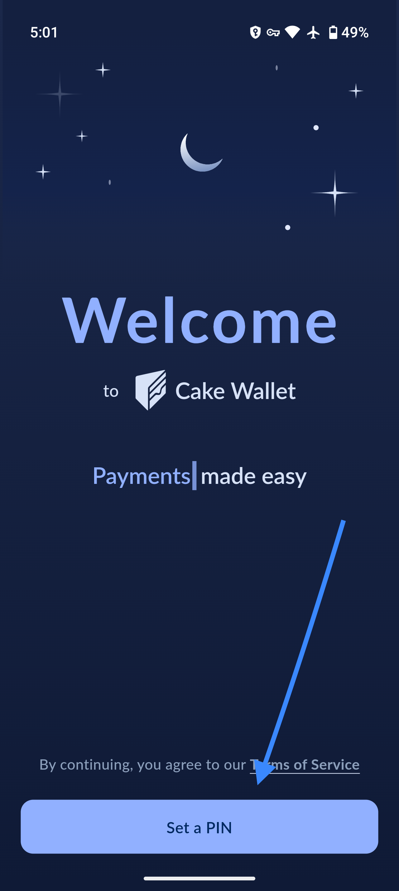
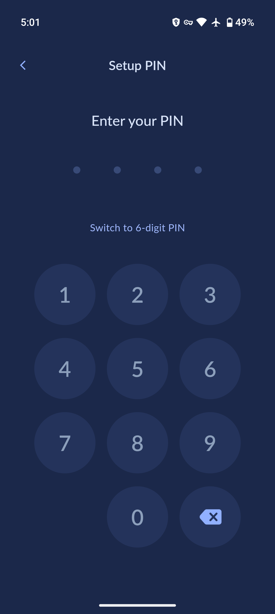
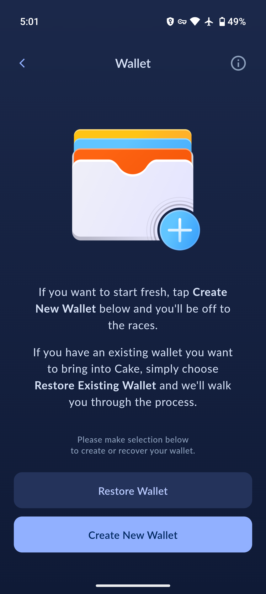

## Getting started

Now that you've installed the app, let’s get you started with setting up Cake Wallet!

!!! note ""
    💁

    **We’re here to help!**

    If at any point you get nervous or need help, please don’t hesitate to reach out to our team in-app or via support@cakewallet.com, where our incredible support staff are waiting to help ease the migration process for you.

## Initial setup

Open Cake Wallet. 

Before setting up a wallet, you will be asked to set an access PIN. This stays on your device. You can choose a 4 digit PIN by default, or you can click the text to change to a 6 digit PIN. You can enable biometric authentication later in settings. For Linux, you need to create a password that will be unique for each wallet.

{:width="32%"}
{:width="32%"}

 

After setting up and confirming a PIN, you will need to select `Create New Wallet` or `Restore Wallet`.

Create a new wallet if you are new to crypto or want to start with a fresh wallet.

Restore an existing wallet if you'd like to keep your funds and addresses of an existing compatible wallet.

Continue the guide through the [Create new wallet](./create-new-wallet#create-the-wallet) or [Restore existing wallet](/get-started/setup/restore#choose-a-restore-option) sections.

{:width="32%"}