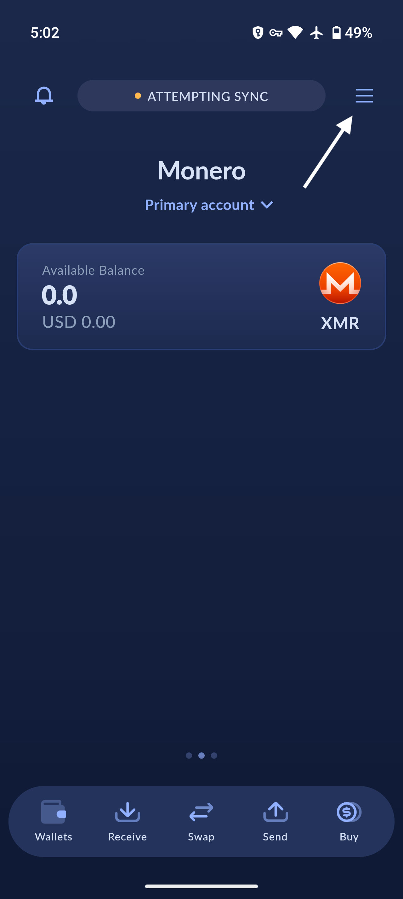

# Restore existing wallet

## Enter the wallets menu
<!-- ??? info "Tip for creating an additional wallet"

    Go to the menu at the top-right. Tap on `Wallets`, then tap `Create New Wallet` at the bottom of your screen.

    {:width="32%"}
    {:width="32%"}
    {:width="32%"} -->
Go to the menu at the top-right. Tap on `Wallets`, then tap `Create New Wallet` at the bottom of your screen.

{:width="32%"}
{:width="32%"}
{:width="32%"}

## Choose a restore option
Choose a restore option and continue the guide through the [Seed or keys](./restore-wallet-from-keys-or-seed.md), [Hardware wallet](./restore-wallet-from-hardware.md), or [Backup file](./restore-wallet-from-backup.md) (Only on fresh installs).

{:width="32%"}