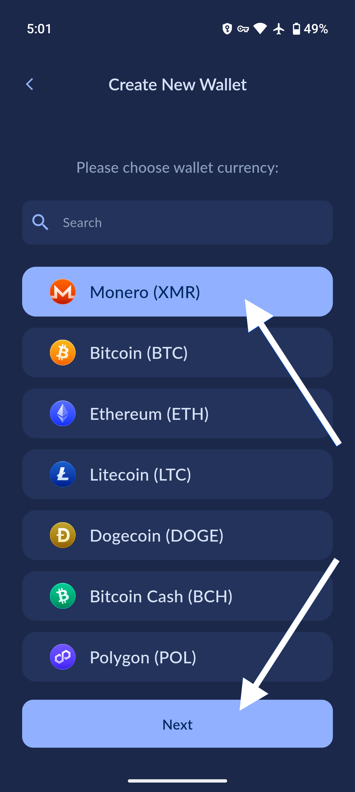

# Restore from seed phrase or keys

!!! warning
    NEVER share your seeds/keys with anyone! If you do, they can steal your funds. Always save your seeds in a safe place!

## Choose a wallet type

Select a wallet type then tap `Next`.

{:width="31.1%"}
{:width="31.1%"}

<!-- ## Import seed phrase or keys
=== "Import seed phrase"

    Test

=== "Import keys"

    Test -->

If you choose Monero, Ethereum, Nano, or Haven, you can restore your wallet from the seed phrase or keys.

To swap from `Restore from seed` to `Restore from keys`, tap the corresponding tabs at the top.

{:width="32%"}
{:width="32%"}

Then above, paste the seed phrase (or keys), choose the "Seed language", and enter the blockheight from when you created the wallet (if applicable).

If you do not know the blockheight, please enter a date from a few days before you created the wallet.

For example, if you created your wallet in Feburary 2020, you could use January 31st, 2020 as the `Restore from date` input. After that, press the `Restore` button and leave your phone awake with the Cake Wallet app open, while your wallet completes synchronization.

{:width="32%"}
{:width="32%"}