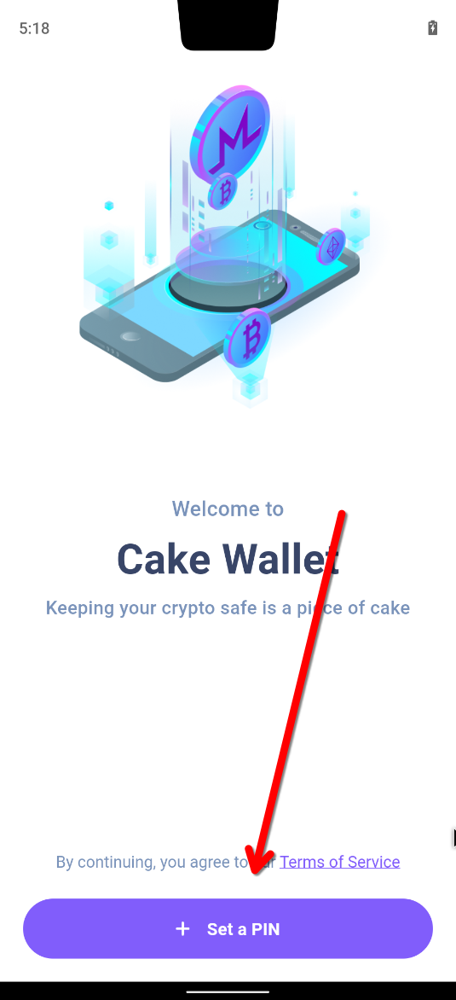
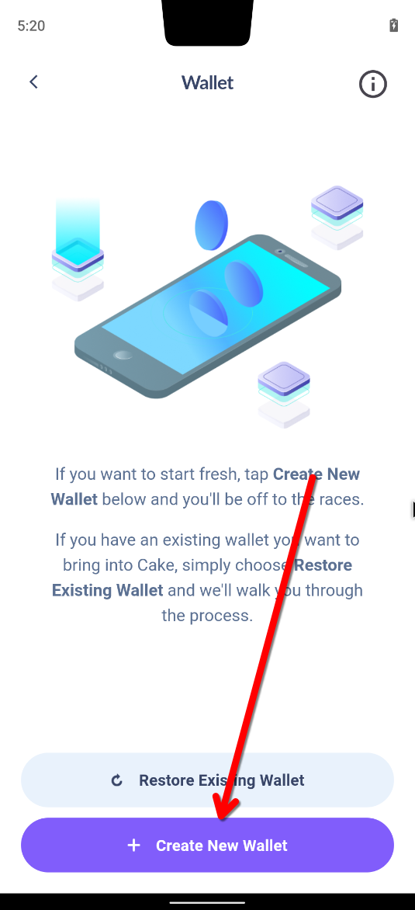
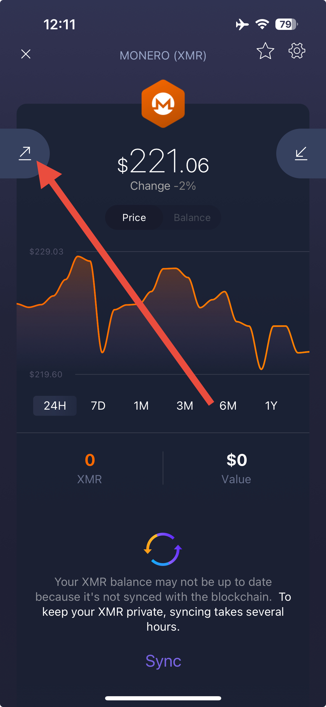
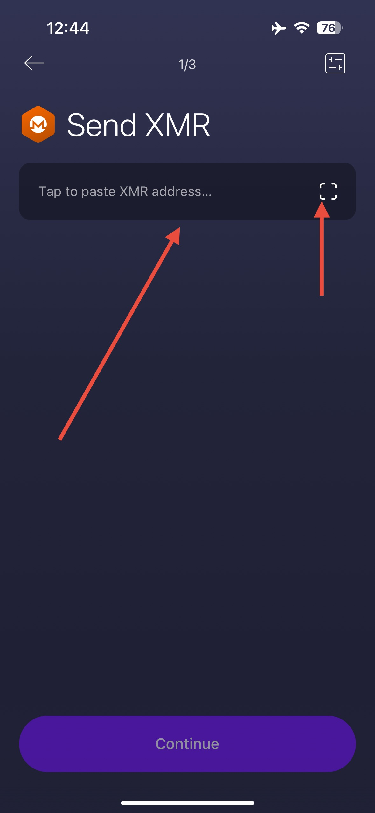
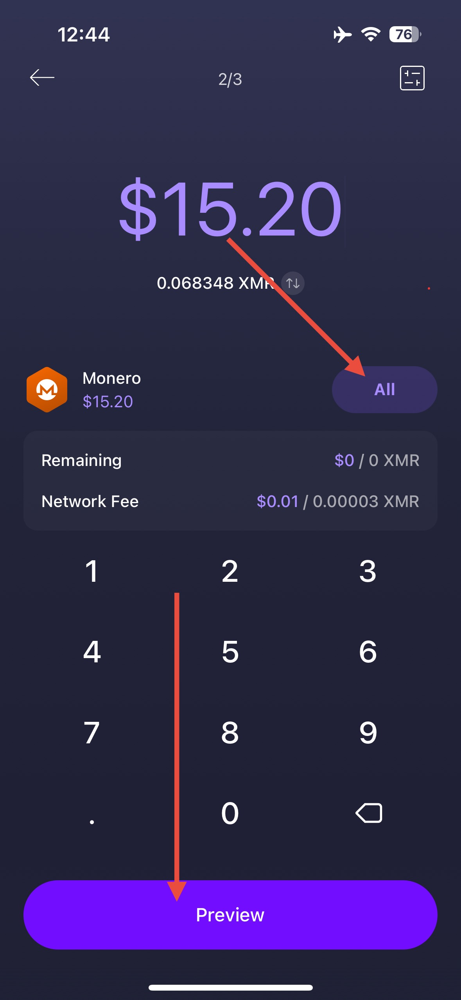
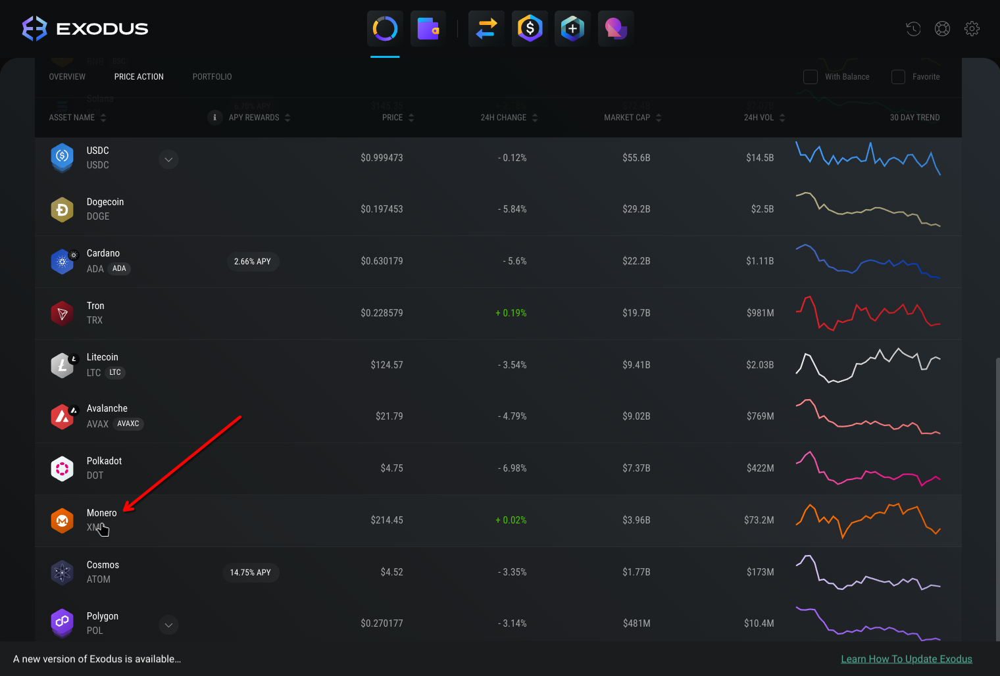

# Migrate from Exodus

We know migrating to a new wallet can be a stressful process, so we’ve worked hard to make this migration as seamless as possible for our users. In the following guide, we’ve broken down the migration process from Exodus wallet → Cake Wallet into an easy-to-follow guide, including screenshots of every step of the process.

## Getting started

Now let’s get you started migrating over! Migrating from Exodus → Cake only requires **three basic steps**, all of which are outlined in detail throughout the guide:

1. [Install Cake Wallet](#installing-cake-wallet)
2. [Create a new Monero wallet](#recommended-method-sending-to-a-new-wallet-in-cake)
3. [Send all of your Monero in Exodus wallet to the newly created Monero wallet in Cake](#send-monero-balance-from-exodus-mobile)

Now for those who specifically want to keep their transaction history or have another reason to re-use their existing Exodus 25-word Monero seed, feel free to jump down to the relevant section:

[*Advanced method:* Exporting an existing wallet to Cake](#advanced-method-exporting-an-existing-wallet-to-cake) 

Not so daunting now, is it? **Let’s get started.**

!!! note ""
    💁

    **We’re here to help!**

    If at any point you get nervous or need help, please don’t hesitate to reach out to our team in-app or via support@cakewallet.com, where our incredible support staff are waiting to help ease the migration process for you.

## Installing Cake Wallet

Cake Wallet is available on Android, iOS, macOS, Linux, and Windows.

For the best compatibility and easiest setup we recommend using the mobile version of Cake Wallet to get started, and then explore our desktop apps down the line.

Please choose one of the options below to get started:

[:simple-android: Android](/get-started/android/){ .md-button }
[:simple-apple: iOS / macOS](/get-started/app-store){ .md-button }
[:simple-linux: Linux](/get-started/linux/){ .md-button }
[:material-microsoft-windows: Windows](/get-started/windows){ .md-button }

## *Recommended method:* Sending to a new wallet in Cake

The easiest path is to simply create a new Monero wallet in Cake Wallet and transfer your funds over with a simple transaction. Not only does this allow you to skip the lengthy synchronization process of restoring an older Monero wallet, but it also lets you get all of the benefits of a new seed format in Monero called “Polyseed.”

This newer seed format is easier to backup and restore (only 16 words, instead of 25), encodes the restore height directly into the seed phrase, and has several other security features that ensure your Monero stays safer than ever.

### Creating a new Monero wallet on Cake

1. Download Cake Wallet [using the links above](#installing-cake-wallet)
2. Open Cake Wallet
3. Tap `Set a PIN` and set a PIN for the app
    1. Note: If you want to use a longer 6-digit PIN, simply tap `Switch to 6-digit PIN`
        
        {: style="height:750px"}
        
4. Tap `Create New Wallet`
    
    {: style="height:750px"}
    
5. Select `Monero` as the wallet currency and then tap `Next`
    
    {: style="height:750px"}
    
6. Enter a wallet name (or tap the 🔄 button to create a random name) and then tap `Next`
    
    {: style="height:750px"}
    
7. Follow the on-screen warnings about your seed phrase, then tap `Verify`

    a. Store your seed phrase in a safe place where you can import it into Cake Wallet in the next section. We recommend a few options:
    - Storing your seed in an **end-to-end encrypted** password manager like [Bitwarden](https://bitwarden.com/), [Proton Pass](https://proton.me/pass), or iCloud Keychain
    - Writing it down and keeping it in a **secure place**
    
!!! warning
    Do not share these seed words with anyone or store them via screenshots or in an insecure note app, as anyone with access to your seed words has the ability to steal all of your Monero!

8. Verify your backup by tapping the correct seed words in the order prompted
9. Tap `Receive` on the bottom dock to display a QR code with a Monero receive address
    1. Note: If necessary, you can easily copy or share the address by tapping the icon next to the address, then sending to yourself via a messaging app, email, etc.

{: style="height:750px"}

{: style="height:750px"}

### Send Monero balance from Exodus Mobile

1. On the home page of Exodus, scroll down and tap on Monero
    
    {: style="height:750px"}
    
2. Tap the Send button at the top left
    
    {: style="height:750px"}
    
3. Scan the QR code in Cake Wallet, or tap the address field to paste in the address, then tap `Continue`
    
    {: style="height:750px"}
    
4. Tap `All` to send the entirety of your Monero balance to your new Cake Wallet, then tap `Preview`
    
    
!!! note
    Feel free to send a smaller, test transaction to Cake Wallet to test if it helps you feel more comfortable before sending your entire wallet balance!
    
{: style="height:750px"}
    
5. Confirm the receiving address is correct on the preview screen, then `Swipe to send`
6. Once you have sent the funds, confirm they show up in your new Monero wallet in Cake

### Send Monero balance from Exodus Desktop

1. Open Exodus Wallet
2. From the portfolio screen, click to open the Monero wallet
    
    
    
3. Click `Send` to open the send menu
    
    
    
4. Paste your address from Cake Wallet into the address field (or scan a QR code on your Cake Wallet app if you have a webcam), click `All` on the amount field, then click `Send`
    
!!! note
    Feel free to send a smaller, test transaction to Cake Wallet to test if it helps you feel more comfortable before sending your entire wallet balance!
    

    
5. Continue following the on-screen instructions, and confirm the receiving address is correct on the send prompt before tapping `Send`
6. Once you have sent the funds, confirm they show up in your new Monero wallet in Cake

## *Advanced method:* Exporting an existing wallet to Cake

For those who want to preserve their transaction history or have a specific reason to keep using their existing Exodus seed phrase, you can easily export it and restore in Cake Wallet. Note that this 25-word seed phrase differs from the general 12-word seed phrase that Exodus uses for other cryptocurrencies, and must be backed up separately before you can restore your Monero wallet in Cake Wallet.

!!! note
    If you’re using Exodus on a desktop or laptop computer, click here to jump directly to desktop instructions 👇

    [Backing up your Monero from Exodus Desktop](#backing-up-your-monero-from-exodus-desktop) 

### Backing up your Monero from Exodus Mobile

1. On the home page of Exodus, scroll down and tap on Monero
2. Tap the ⚙️ icon at the top right
3. Copy the wallet creation height and save it for later
    1. Using the wallet creation height when restoring in Cake Wallet will drastically reduce the initial sync time, so be sure to save it somewhere!
4. Tap `View Private Key`
5. Confirm that you’re in a safe place and are OK to display your private keys on-screen

!!! warning
    Do not share these seed words with anyone or store them via screenshots or in an insecure note app, as anyone with access to your seed words has the ability to steal all of your Monero!

1. Either tap the copy button, or write down your 25-word seed phrase (in the box labeled `Mnemonic`) in a safe place where you can import it into Cake Wallet in the next section. We recommend a few options:
    - Storing your seed in an **end-to-end encrypted** password manage like Bitwarden, Proton Pass, or iCloud Keychain
    - Writing it down and keeping it in a **secure place**

### Backing up your Monero from Exodus Desktop

1. From the Portfolio page, scroll down to find your Monero wallet, and click on it to open the Monero wallet page.

{: style="height:750px"}

1. Once you are on the Monero wallet page, click the three dots near the top right to open a menu

{: style="height:750px"}

1. Click `View Private Keys`

{: style="height:750px"}

1. Click `Yes, I'm Sure`

{: style="height:750px"}

1. Copy the words from the `Mnemonic` field to your clipboard, this is also known as the `seed phrase`

{: style="height:750px"}

!!! warning
    Do not share these seed words with anyone or store them via screenshots or in an insecure note app, as anyone with access to your seed words has the ability to steal all of your Monero!

1. Store your seed phrase in a safe place where you can import it into Cake Wallet in the next section. We recommend a few options:
    - Storing your seed in an **End-to-End Encrypted** password manage like Bitwarden, Proton Pass, or iCloud Keychain
    - Writing it down and keeping it in a **secure place**

### Restoring your wallet in Cake Wallet

1. Tap `Set a PIN` and set a PIN for the app
    
    {: style="height:750px"}
    
2. Tap `Restore Existing Wallet` 
    
    {: style="height:750px"}
    
3. Tap `Restore from seed/keys`
    
    {: style="height:750px"}
    
4. Select `Monero` as wallet currency and then tap `Next`
    
    {: style="height:750px"}
    
5. Choose a name for the wallet
    
    {: style="height:750px"}
    
6. Paste or type in the seed phrase from Exodus wallet that you backed up earlier
    
    {: style="height:750px"}
    
7. Tap the `Polyseed (16 words)` option and change to `Legacy (25 words)`

{: style="height:750px"}

{: style="height:750px"}

1. Enter the saved wallet creation height number from your Exodus Monero wallet
    1. i.e. `3344621`
    
    {: style="height:750px"}
    
2. Tap `Restore`
3. Once restored, you will see a synchronization status bar at the top of the balance screen as Cake Wallet checks the Monero blockchain for your wallet history and balance
    
    {: style="height:750px"}
    
4. When Cake Wallet finishes the synchronization process and the top bar says `SYNCHRONIZED`, you will see your full balance and transaction history

# Using Cake Wallet

Cake Wallet is the user-friendly, multi-asset cryptocurrency wallet that prioritizes financial privacy and autonomy. With seamless swaps, strong privacy tools, and a focus on accessibility, Cake Wallet empowers you to manage, swap, and spend your digital assets securely and confidently. Cake Wallet is also 100% open-source, ensuring that every bit of code is able to be verified and independently reviewed, keeping your crypto safer than ever from attacks or mistakes.

Cake Wallet also enables you to easily swap between cryptocurrencies without leaving the app, buy and sell directly from fiat, and even use your crypto to buy every day items and treat yourself with [Cake Pay](https://cakepay.com). It’s your freedom money, and Cake helps free you up to use it in more ways than ever.