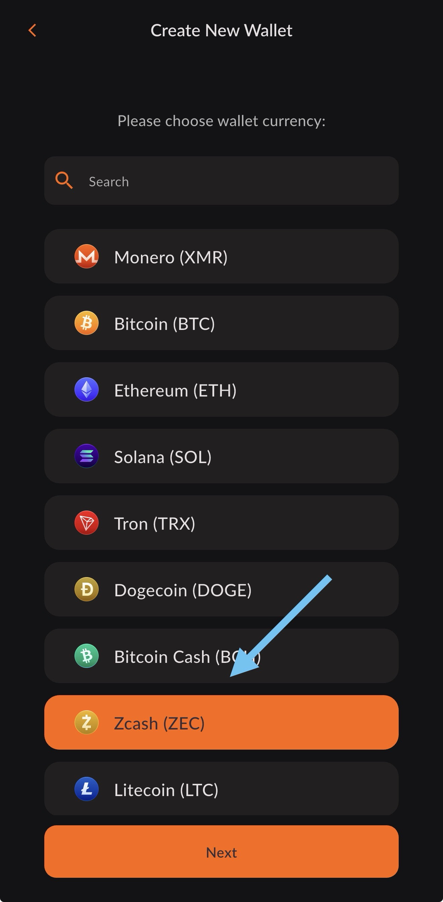
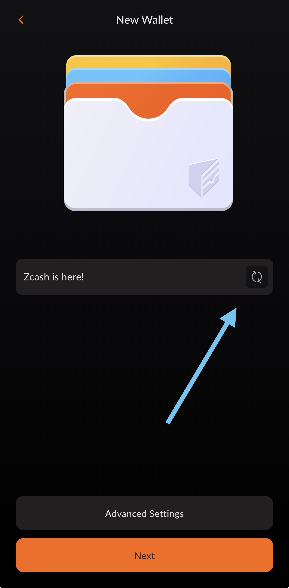
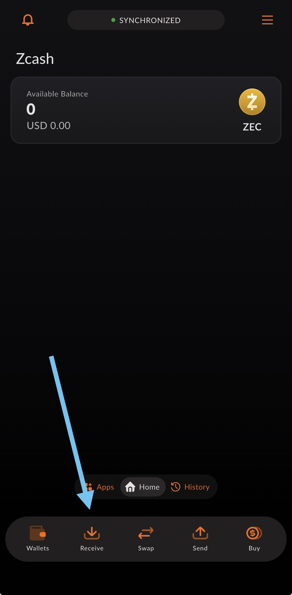
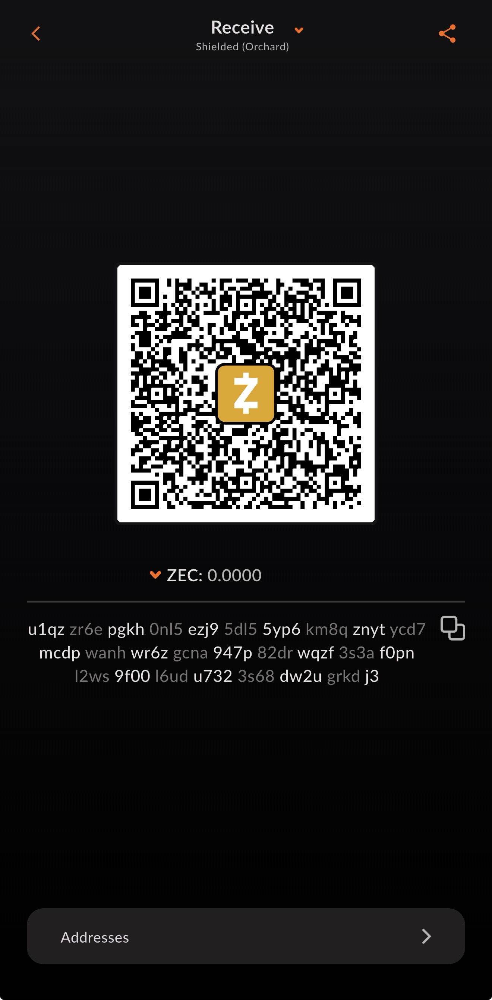
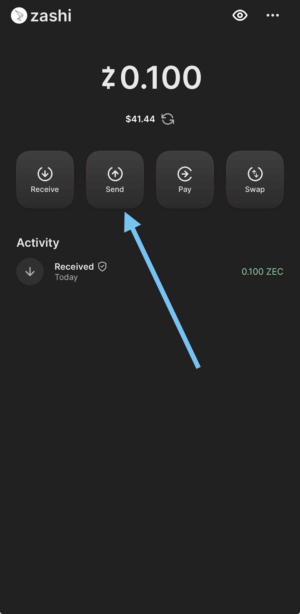
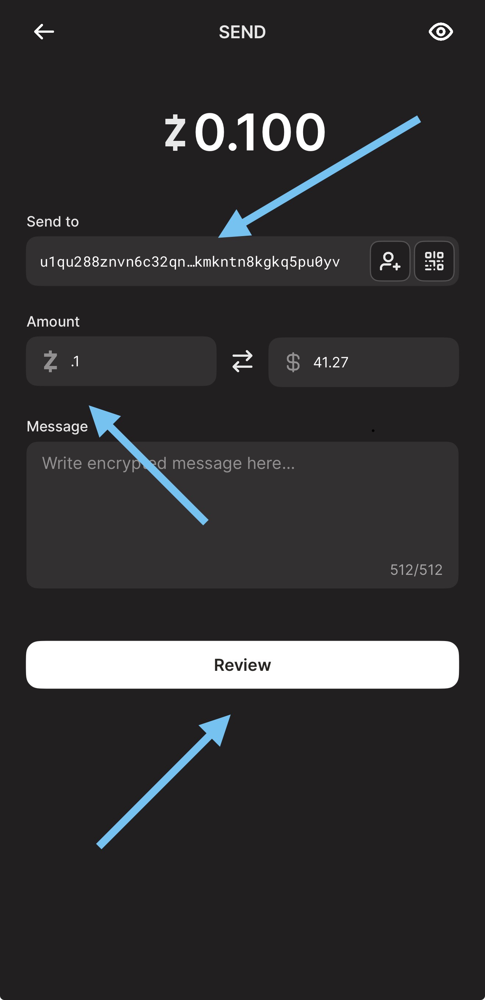

# Migrate from Zashi

We know migrating to a new wallet can be a stressful process, so we’ve worked hard to make this migration as seamless as possible for our users. In the following guide, we’ve broken down the migration process from Zashi wallet → Cake Wallet into an easy-to-follow guide, including screenshots of every step of the process.

## Getting started

Now let’s get you started migrating over! Migrating from Zashi → Cake only requires **three basic steps**, all of which are outlined in detail throughout the guide:

- [Migrate from Zashi](#migrate-from-zashi)
  - [Getting started](#getting-started)
  - [Installing Cake Wallet](#installing-cake-wallet)
  - [*Recommended method:* Sending to a new wallet in Cake](#recommended-method-sending-to-a-new-wallet-in-cake)
    - [Creating a new Zcash wallet on Cake](#creating-a-new-zcash-wallet-on-cake)
    - [Send Zcash balance from Zashi](#send-zcash-balance-from-zashi)
- [Using Cake Wallet](#using-cake-wallet)

Not so daunting now, is it? **Let’s get started.**

!!! note ""
    💁

    **We’re here to help!**

    If at any point you get nervous or need help, please don’t hesitate to reach out to our team in-app or via support@cakewallet.com, where our incredible support staff are waiting to help ease the migration process for you.

## Installing Cake Wallet

Cake Wallet is available on Android, iOS, macOS, Linux, and Windows.

For the best compatibility and easiest setup we recommend using the mobile version of Cake Wallet to get started, and then explore our desktop apps down the line.

Please choose one of the options below to get started:

[:simple-android: Android](/get-started/android/){ .md-button }
[:simple-apple: iOS / macOS](/get-started/app-store){ .md-button }
[:simple-linux: Linux](/get-started/linux/){ .md-button }
[:material-microsoft-windows: Windows](/get-started/windows){ .md-button }

## *Recommended method:* Sending to a new wallet in Cake

The easiest path is to simply create a new Zcash wallet in Cake Wallet and transfer your funds over with a simple transaction. Not only does this allow you to skip the lengthy synchronization process of restoring an older Zcash wallet, but it also lets you get all of the benefits of using [one seed for all of your crypto hot wallets](https://blog.cakewallet.com/cake-wallet-introduces-monero-wallet-groups-new-seed-formats-and-more/).

With a new, 12-word seed, you get a fresh start, faster restoration, and the ability to leverage one backup for all of your favorite cryptocurrency wallets in Cake.

### Creating a new Zcash wallet on Cake

1. Download Cake Wallet [using the links above](#installing-cake-wallet)
2. Open Cake Wallet
3. Tap `Set a PIN` and set a PIN for the app
    1. Note: If you want to use a longer 6-digit PIN, simply tap `Switch to 6-digit PIN`
        
        {: style="height:750px"}
        
4. Tap `Create New Wallet`
    
    {: style="height:750px"}
    
5. Select `Zcash` as the wallet currency and then tap `Next`
    
    {: style="height:750px"}
    
    !!! note
        If you already have an existing wallet or wallet group in Cake Wallet, you can choose that group here to use an existing 12-word seed.

6. Enter a wallet name (or tap the 🔄 button to create a random name) and then tap `Next`
    
    {: style="height:750px"}
    
7. Follow the on-screen warnings about your seed phrase, then tap `Verify`

    a. Store your seed phrase in a safe place where you can import it into Cake Wallet in the next section. We recommend a few options:
    - Storing your seed in an **end-to-end encrypted** password manager like [Bitwarden](https://bitwarden.com/), [Proton Pass](https://proton.me/pass), or iCloud Keychain
    - Writing it down and keeping it in a **secure place**
    
!!! warning
    Do not share these seed words with anyone or store them via screenshots or in an insecure note app, as anyone with access to your seed words has the ability to steal all of your Zcash!
    
1. Verify your backup by tapping the correct seed words in the order prompted
2. Tap `Receive` on the bottom dock to display a QR code with a Zcash receive address
    1. Note: If necessary, you can easily copy or share the address by tapping the icon next to the address, then sending to yourself via a messaging app, email, etc. 

{: style="height:750px"}

{: style="height:750px"}

### Send Zcash balance from Zashi

1. Open Zashi
    
2. Tap the Send button in the middle of your screen
    
    {: style="height:750px"}
    
3. Scan the QR code in Cake Wallet by tapping the QR code icon in the address box, or double tap or hold on the address field to paste in the address
4. Enter as close to the spendable balance as you can to send the entirety of your Zcash balance to your new Cake Wallet, then tap `Review`
    
    {: style="height:750px"}
    {: style="height:750px"}
    
!!! note
    Feel free to send a smaller, test transaction to Cake Wallet to test if it helps you feel more comfortable before sending your entire wallet balance!

1. Review the details, and then press `Send` when ready
2. Once you have sent the funds, confirm they show up in your new Zcash wallet in Cake

# Using Cake Wallet

Cake Wallet is the user-friendly, multi-asset cryptocurrency wallet that prioritizes financial privacy and autonomy. With seamless swaps, strong privacy tools, and a focus on accessibility, Cake Wallet empowers you to manage, swap, and spend your digital assets securely and confidently. Cake Wallet is also 100% open-source, ensuring that every bit of code is able to be verified and independently reviewed, keeping your crypto safer than ever from attacks or mistakes.

Cake Wallet also enables you to easily swap between cryptocurrencies without leaving the app, buy and sell directly from fiat, and even use your crypto to buy every day items and treat yourself with [Cake Pay](https://cakepay.com). It’s your freedom money, and Cake helps free you up to use it in more ways than ever.
